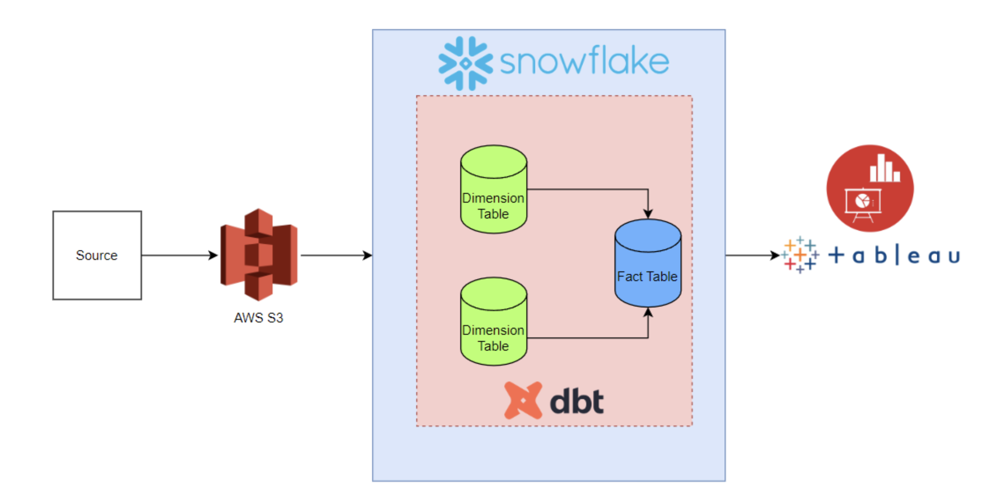

# Walmart BI Analytics — Data Engineering Project



**Stack:** Snowflake · dbt · Tableau · Python (Matplotlib / Plotly / Seaborn)

---

## Table of Contents
1. [Project Overview](#1-project-overview)
2. [Architecture](#2-architecture)
3. [Technology Stack](#3-technology-stack)
4. [Repository Structure](#4-repository-structure)
5. [Setup Instructions](#5-setup-instructions)
6. [DBT Models](#6-dbt-models)
7. [Data Model (Dimensional Design)](#7-data-model-dimensional-design)
8. [Python Visualizations](#8-python-visualizations)
9. [Tableau Dashboards](#9-tableau-dashboards)
10. [Known Issues & Questions for Coaches](#10-known-issues--questions-for-coaches)

---

## 1. Project Overview

This project performs end-to-end data engineering and business intelligence analysis on Walmart's retail dataset. Raw sales, store, and department data is ingested from S3 into Snowflake, transformed using dbt into dimensional models (SCD1 and SCD2), and visualized through Tableau and Python.

**Objective:** Analyze Walmart weekly sales across stores, departments, dates, and economic indicators to surface actionable business insights.

---

## 2. Architecture

```
S3 Bucket (walmart-bi-dea)
        │
        ▼
Snowflake External Stage
        │
        ▼
dbt Raw Models (PUBLIC schema)
  ├── department_raw
  ├── fact_raw
  └── stores_raw
        │
        ▼
dbt Dimension & Fact Models (BRONZE schema)
  ├── walmart_date_dim     ← SCD1 (merge/upsert)
  ├── walmart_store_dim    ← SCD1 (merge/upsert)
  └── walmart_fact_table   ← SCD2 (via snapshot)
        │
        ▼
dbt Snapshot (SNAPSHOTS schema)
  └── walmart_fact_table_snapshot
        │
        ├──► Tableau Desktop (Dashboards)
        └──► Python (Matplotlib / Plotly / Seaborn charts)
```

See [`architecture-diagram.png`](architecture-diagram.png) for the visual diagram.

---

## 3. Technology Stack

| Tool | Purpose |
|---|---|
| **AWS S3** | Raw file storage |
| **AWS IAM** | Snowflake–S3 access role |
| **Snowflake** | Cloud data warehouse |
| **dbt Cloud** | Data transformation, modeling, testing |
| **Tableau Desktop** | BI dashboards and visualizations |
| **Python** | Programmatic charts (matplotlib, plotly, seaborn) |

---

## 4. Repository Structure

```
walmart-analytics/
├── README.md
├── architecture-diagram.png
│
├── source-data/                          # Raw CSV source files
│   ├── department.csv
│   ├── fact.csv
│   └── stores.csv
│
├── snowflake/
│   ├── setup.sql                         # Storage integration, stage, file format, grants
│   └── filter-data-for-local-python-querying.sql  # Gold layer: pre-joined reduced table for pandas
│
├── Tableau-visualizations.md             # Tableau dashboard screenshots with labels
│
├── dbt/
│   ├── models/
│   │   ├── raw/                          # Stage → Snowflake raw tables
│   │   │   ├── department_raw.sql
│   │   │   ├── fact_raw.sql
│   │   │   └── stores_raw.sql
│   │   ├── dimensions/                   # SCD1 dimension models
│   │   │   ├── walmart_date_dim.sql
│   │   │   └── walmart_store_dim.sql
│   │   └── facts/                        # Final fact table from snapshot
│   │       └── walmart_fact_table.sql
│   ├── snapshots/                        # SCD2 snapshot
│   │   └── walmart_fact_table_snapshot.sql
│   └── schema.yml                        # dbt tests
│
├── python/
│   └── visualizations.py                 # All Python charts + Snowflake connection
│
└── data-visualization-images/            # Exported chart screenshots
    ├── image1.png
    └── ... image14.png
```

---

## 5. Setup Instructions

### Prerequisites
- Snowflake account (ACCOUNTADMIN role)
- dbt Cloud account (connected to Snowflake)
- Tableau Desktop
- Python 3.8+ with packages: `snowflake-sqlalchemy`, `pandas`, `matplotlib`, `plotly`, `seaborn`

### Step 1 — AWS Setup
1. Create S3 bucket: `walmart-bi-dea`, upload the 3 CSV files under `data/`
2. Create IAM role `Walmart_project_snowflake_role` with `AmazonS3FullAccess` policy
3. Set placeholder external ID `0000` in the trust relationship (update after Step 2)

### Step 2 — Snowflake Storage Integration
Run [`snowflake/setup.sql`](snowflake/setup.sql) in order:
1. Creates the `WALMART` database
2. Creates the storage integration `SNOWFLAKE_WALMART_S3_INT`
3. Run `DESC INTEGRATION SNOWFLAKE_WALMART_S3_INT` — copy `STORAGE_AWS_EXTERNAL_ID` and `STORAGE_AWS_IAM_USER_ARN` back into the IAM trust relationship in AWS
4. Creates the external stage and CSV file format

### Step 3 — dbt Setup
1. Connect dbt Cloud to your Snowflake account
2. Set your dbt project to use the `dbt/` folder as the models directory
3. Run in order:
   ```
   dbt run --select raw.*
   dbt run --select dimensions.*
   dbt snapshot
   dbt run --select facts.*
   ```
4. Optionally run `dbt test` to validate not-null and unique constraints

### Step 4 — Python Visualizations
```bash
pip install snowflake-sqlalchemy pandas matplotlib plotly seaborn
python python/visualizations.py
```
> ⚠️ The full 3-table join is very large. The script uses the pre-joined `WALMART.PUBLIC_GOLD.WALMART_JOINED_REDUCED` table for performance. Run [`snowflake/filter-data-for-local-python-querying.sql`](snowflake/filter-data-for-local-python-querying.sql) in Snowflake first to create this table.

### Step 5 — Tableau
1. Open Tableau Desktop → Connect to Snowflake
2. Connect to `WALMART.PUBLIC_BRONZE` schema
3. Join `WALMART_FACT_TABLE`, `WALMART_STORE_DIM`, `WALMART_DATE_DIM`

---

## 6. DBT Models

### Raw Layer (`models/raw/`)
Reads directly from the Snowflake external stage (S3) and materializes as tables. Casts each column to its correct data type.

| Model | Source File | Key Columns |
|---|---|---|
| [`department_raw`](dbt/models/raw/department_raw.sql) | [department.csv](source-data/department.csv) | store_id, dept_id, store_date, weekly_sales, isholiday |
| [`fact_raw`](dbt/models/raw/fact_raw.sql) | [fact.csv](source-data/fact.csv) | store_id, store_date, temperature, fuel_price, markdowns, cpi, unemployment |
| [`stores_raw`](dbt/models/raw/stores_raw.sql) | [stores.csv](source-data/stores.csv) | store_id, store_type, store_size |

### Dimension Layer (`models/dimensions/`) — SCD1

Both dimension models use `materialized='incremental'` with `incremental_strategy='merge'`. This means on the first run they create the table; on subsequent runs they **upsert** (insert new rows or update existing rows based on the unique key). History is **not** preserved — only the latest value is kept.

**[`walmart_date_dim`](dbt/models/dimensions/walmart_date_dim.sql)**
- Unique key: `date_id` (derived as `TO_CHAR(store_date, 'YYYYMMDD')::INT`)
- Source: `department_raw`
- Tracks: date, isholiday flag

**[`walmart_store_dim`](dbt/models/dimensions/walmart_store_dim.sql)**
- Unique key: `(store_id, dept_id)` composite
- Source: join of `stores_raw` + `department_raw`
- Tracks: store type, store size

### Snapshot Layer (`snapshots/`) — SCD2

[`walmart_fact_table_snapshot`](dbt/snapshots/walmart_fact_table_snapshot.sql) uses dbt's `snapshot` feature with `strategy='check'`. It monitors a set of measure columns and when any value changes for a given `(store_id, dept_id, store_date)` combination, it **closes** the old record (sets `dbt_valid_to`) and **inserts** a new version. This preserves full history.

### Fact Layer (`models/facts/`)

[`walmart_fact_table`](dbt/models/facts/walmart_fact_table.sql) reads from the snapshot table and surfaces only **current records** (`WHERE dbt_valid_to IS NULL`), exposing `dbt_valid_from` as `vrsn_start_date` and `dbt_valid_to` as `vrsn_end_date`.

### Schema Tests ([`schema.yml`](dbt/schema.yml))
- `date_id`: not_null, unique
- `store_id`: not_null

---

## 7. Data Model (Dimensional Design)

```
walmart_date_dim              walmart_store_dim
────────────────              ─────────────────
date_id (PK)                  store_id (PK)
store_date                    dept_id (PK)
isholiday                     store_type
insert_date                   store_size
update_date                   insert_date
                              update_date
         │                         │
         └──────────┬──────────────┘
                    ▼
           walmart_fact_table
           ──────────────────
           store_id (FK)
           dept_id (FK)
           store_date (FK → date_dim)
           store_weekly_sales
           fuel_price
           store_temperature
           unemployment
           cpi
           markdown1–5
           vrsn_start_date
           vrsn_end_date
           insert_date
           update_date
```

**SCD Types:**
- `walmart_date_dim` → **SCD Type 1** (upsert, no history)
- `walmart_store_dim` → **SCD Type 1** (upsert, no history)
- `walmart_fact_table` → **SCD Type 2** (versioned via dbt snapshot, history preserved)

---

## 8. Python Visualizations

All charts are in [`python/visualizations.py`](python/visualizations.py). They connect to Snowflake and pull from the pre-joined gold table `WALMART.PUBLIC_GOLD.WALMART_JOINED_REDUCED` for performance.

Charts produced:
1. Weekly Sales by Store and Holiday (stacked bar)
2. Weekly Sales by Temperature and Year (scatter)
3. Weekly Sales by Store Size (scatter)
4. Weekly Sales by Store Type and Month (grouped bar)
5. Markdown Sales by Year and Store (line)
6. Weekly Sales by Store Type (box plot)
7. Fuel Price by Year (line)
8. Weekly Sales by Year, Month and Date (time series)
9. Weekly Sales by CPI (scatter)
10. Department-wise Weekly Sales (bar)

---

## 9. Tableau Dashboards

Tableau dashboards were built by connecting directly to Snowflake (`WALMART.PUBLIC_BRONZE`). See [`Tableau-visualizations.md`](Tableau-visualizations.md) for all labeled dashboard screenshots.

Charts cover:
- Weekly Sales by Store & Holiday
- Weekly Sales by Temperature & Year
- Weekly Sales by Store Size
- Weekly Sales by Store Type & Month
- Markdown Sales by Year & Store
- Fuel Price by Year
- Weekly Sales by Year / Month / Date
- Department-wise Weekly Sales

---

## 10. Known Issues & Questions for Coaches

### Data Quality Issues
- **Duplicate rows in `department.csv`:** The department CSV contains many duplicate `(store_id, store_date)` rows. This caused issues testing SCD logic — because no true "new" versions of the data exist, incremental/snapshot runs after the first don't update meaningfully.
- **Fact table duplicate combinations:** The fact table has hundreds of duplicate rows for the same `(store_id, dept_id, store_date)` key, which complicates SCD2 versioning.

### SCD Logic Questions
1. Since the source data doesn't actually change between runs, is the SCD1/SCD2 logic **hypothetical** (demonstrating the pattern) or were we expected to simulate data changes?
2. For the **SCD1 `merge` strategy in dbt** — is the upsert logic happening automatically via Snowflake's `MERGE` statement under the hood, or is additional logic needed?
3. For **SCD2 with the `snapshot`** — when a change is detected in `weekly_sales`, it seems to version out records for all rows sharing the same `store_id` and `store_date`, not just the changed row. Is this expected behavior or a configuration issue?
4. The second run of the dimension tables takes 20+ minutes and doesn't complete. Is this a warehouse size issue, or is there a problem with the incremental filter logic?

### Performance Issues
- Joining all 3 tables in Python (full data) generated billions of rows and took 24+ hours — had to cancel. Resolved by: creating a reduced gold table in Snowflake (`WALMART_JOINED_REDUCED`) using row-number deduplication and store-size filtering, then pulling that into pandas.
- **Question:** How do data engineers typically handle this at scale — do they always sample, use Spark, or pre-aggregate in the warehouse before pulling to Python?

### Tableau vs Python
- Tableau handled the large join with no performance issues. **Question:** Is Tableau joining the tables in the warehouse (pushdown) or locally? How does it handle this so much faster than pandas?

### dbt Schema YML
- Is the `schema.yml` file required for the project to be valid, or is it optional/best practice?
