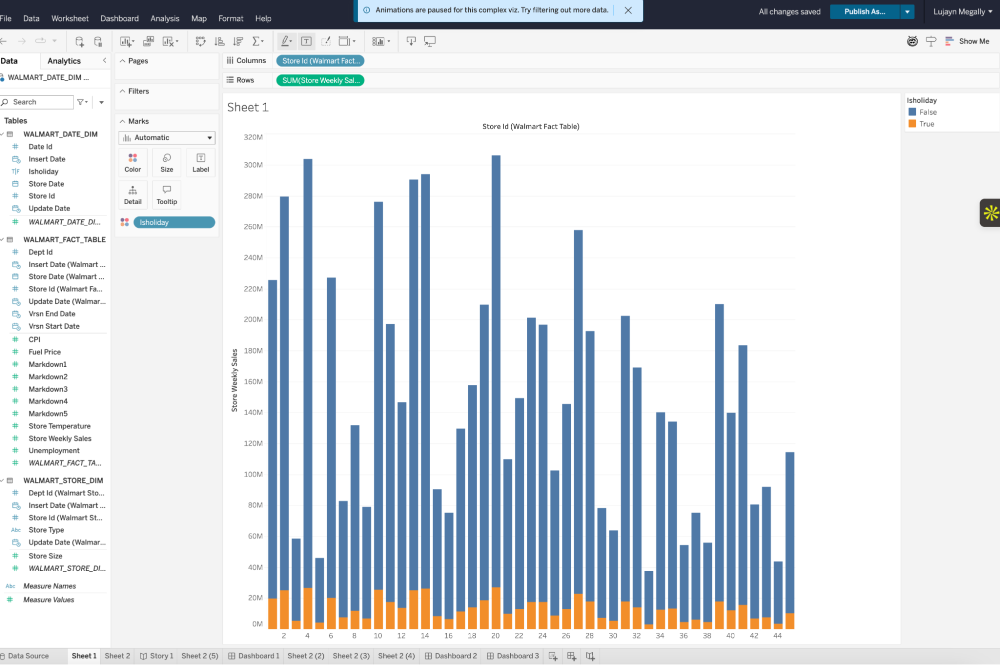
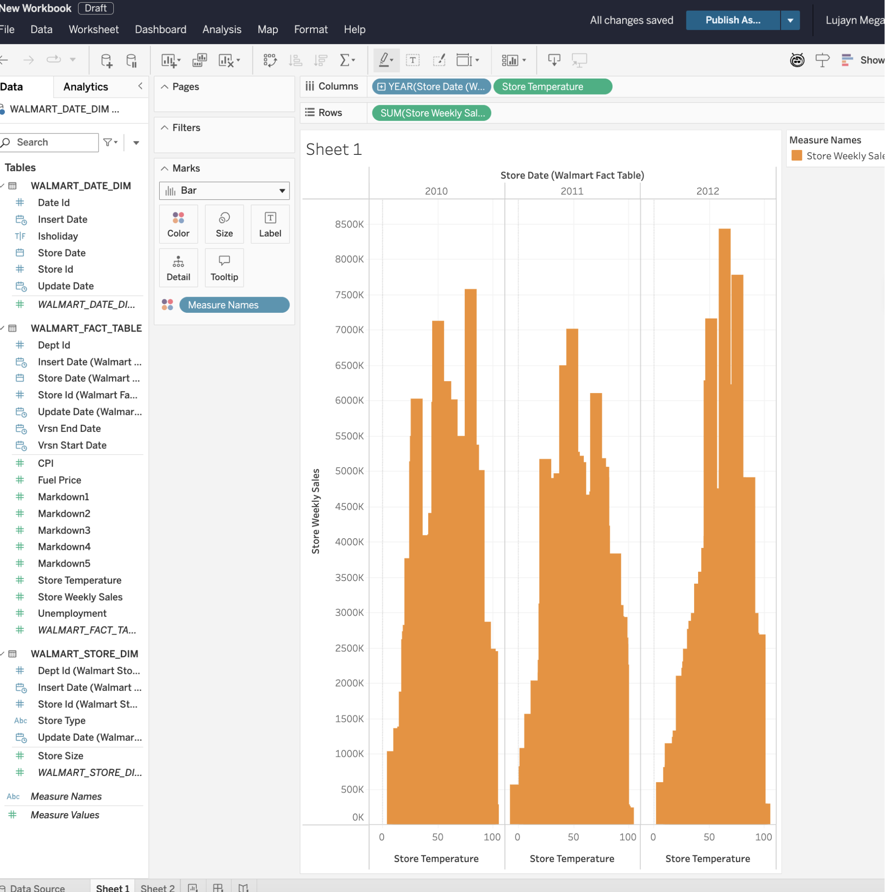
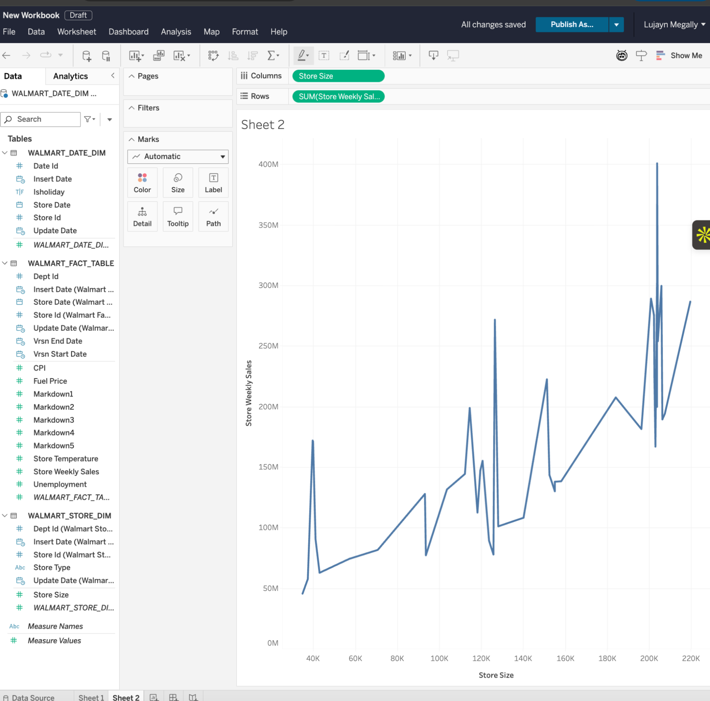
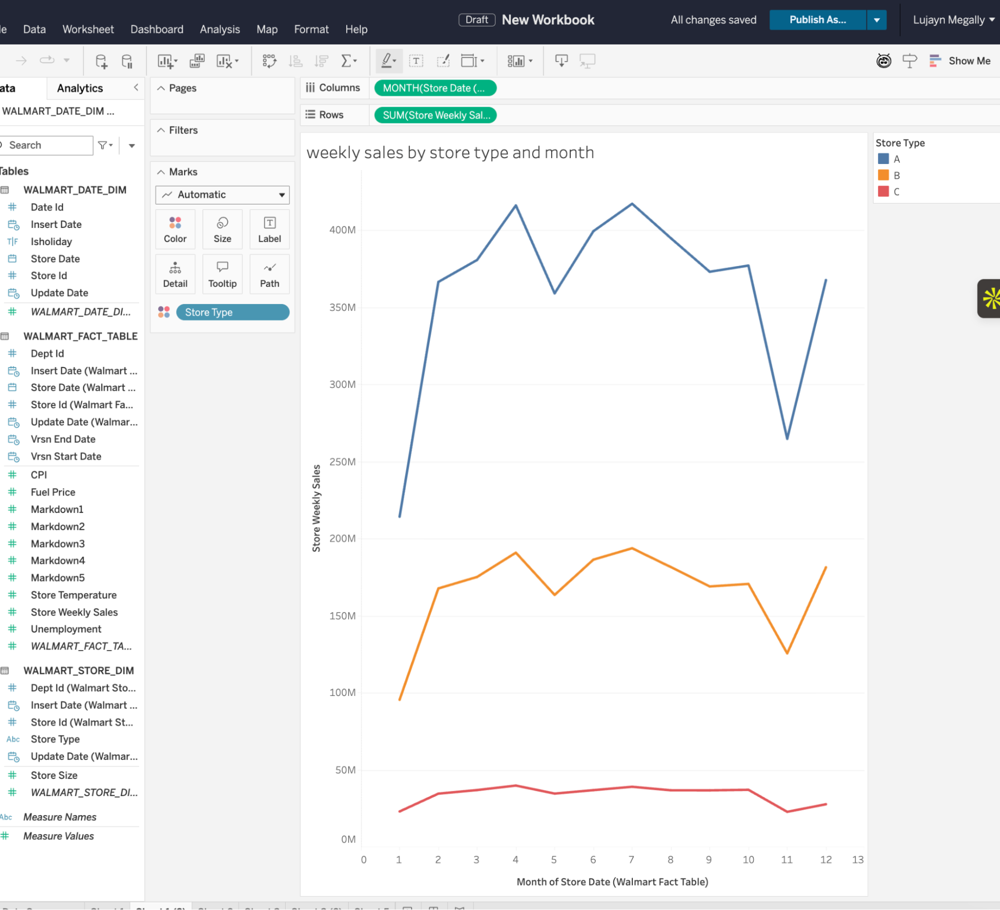
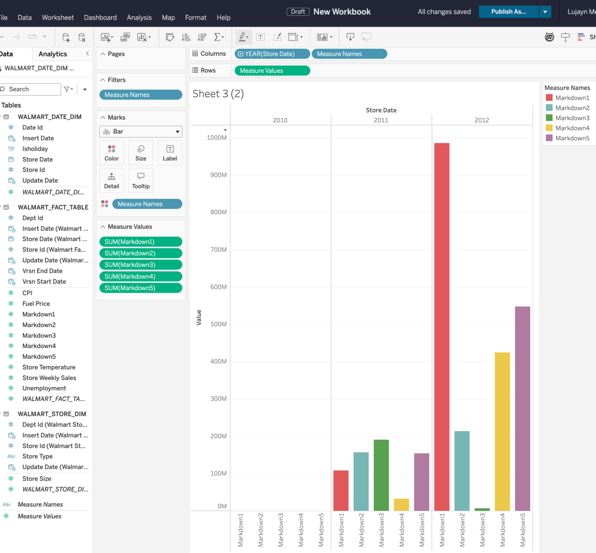
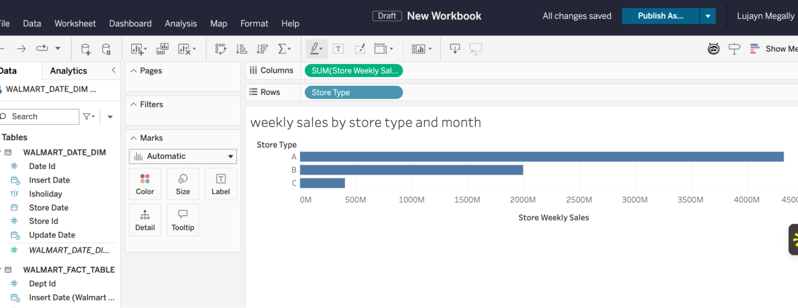
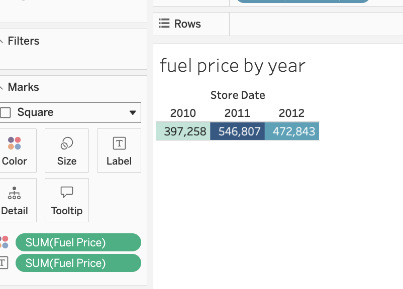
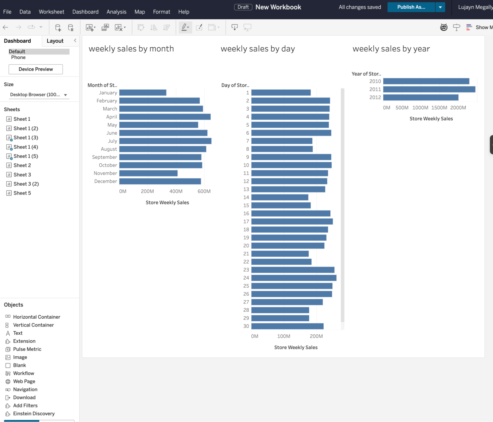
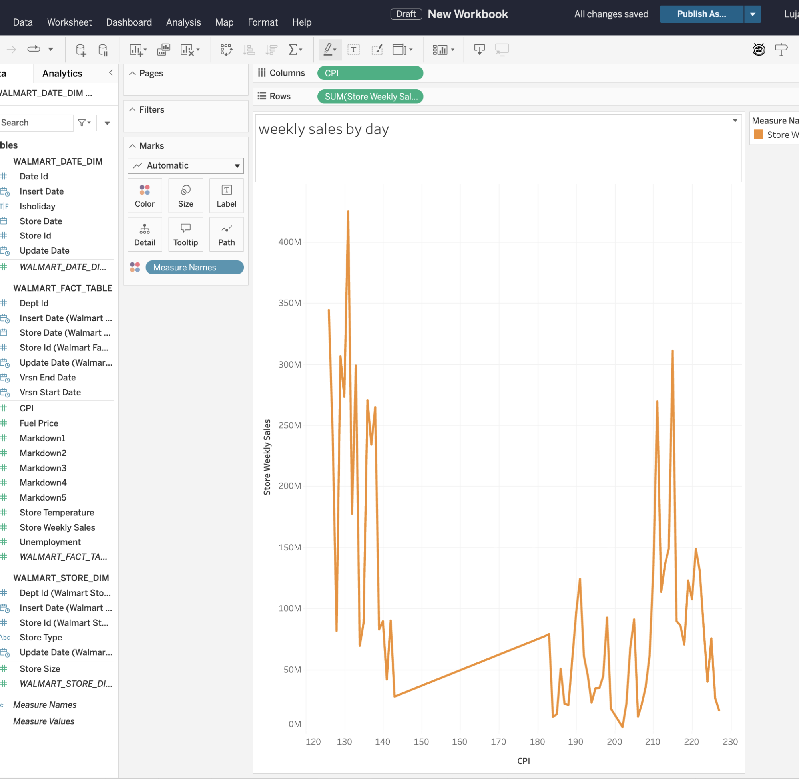
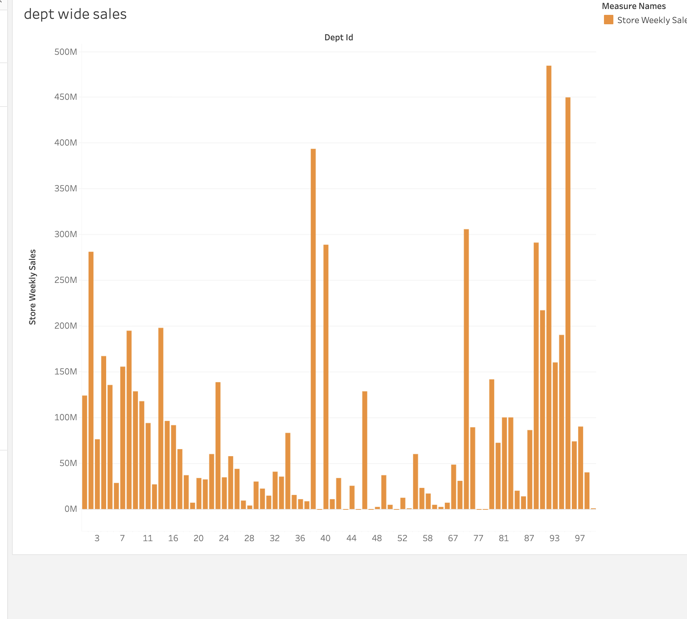

# Tableau Dashboard — Walmart Analytics

All dashboards built in Tableau Desktop connected to `WALMART.PUBLIC_BRONZE` in Snowflake.

---

### 1. Weekly Sales by Store and Holiday

---

### 2. Weekly Sales by Temperature and Year

---

### 3. Weekly Sales by Store Size

---

### 4. Weekly Sales by Store Type and Month

---

### 5. Markdown Sales by Year and Store

---

### 6. Weekly Sales by Store Type

---

### 7. Fuel Price by Year

---

### 8. Weekly Sales by Year, Month and Date

---

### 9. Weekly Sales by CPI
> ⚠️ *Note: Grouping may be by date/store ID — to confirm with coach.*

---

### 10. Department-wise Weekly Sales

